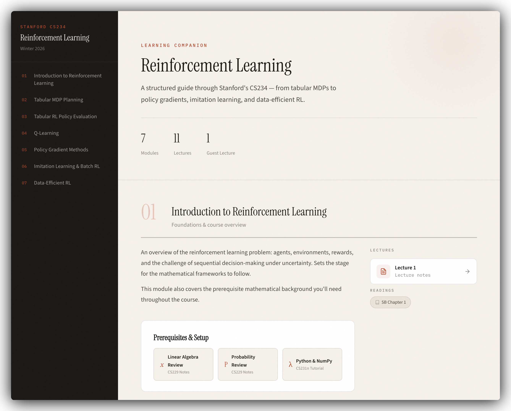

  <picture>
    <source media="(prefers-color-scheme: dark)" srcset="https://latex.codecogs.com/svg.image?\dpi{200}\color{white}V^*(s)=\max_a\left[R(s,a)+\gamma\sum_{s'}P(s'|s,a)\,V^*(s')\right]">
    
  </picture>

<h1 align="center">CS234 Learning Companion</h1>

  <em>A beautifully typeset, open study guide for Stanford's graduate RL course.</em> 
  <em>Because the Bellman equation is too elegant to learn from ugly notes.</em>

  
  
  

  

---

## What is this?

This is a **free, open-source study companion** for [Stanford CS234: Reinforcement Learning](https://web.stanford.edu/class/cs234/) (Winter 2026, taught by [Emma Brunskill](https://cs.stanford.edu/people/ebrun/)).

Every lecture from the course is distilled into clean, readable HTML pages with:

- Precise **KaTeX-rendered mathematics** (no blurry images of equations)
- Color-coded **definition**, **theorem**, **example**, and **insight** callouts
- **Algorithm pseudocode** blocks you can actually follow
- Collapsible **proofs** (click to expand when you're ready)
- A floating **table of contents** with scroll-tracking so you never get lost
- Direct links to the original **PDF slides**

  

## Topics covered

| Module | Topic | Key ideas |
|--------|-------|-----------|
| 1 | [Introduction to RL](https://maninae.github.io/cs234/lectures/lecture01.html) | what RL is, why it matters now |
| 2 | [Tabular MDP Planning](https://maninae.github.io/cs234/lectures/lecture02.html) | Bellman equations, value & policy iteration |
| 3 | [Model-Free Policy Evaluation](https://maninae.github.io/cs234/lectures/lecture03.html) | Monte Carlo, TD learning, bias-variance |
| 4 | [Q-Learning](https://maninae.github.io/cs234/lectures/lecture04.html) | off-policy control, SARSA, function approx |
| 5 | [Policy Gradients](https://maninae.github.io/cs234/lectures/lecture05.html) | REINFORCE, actor-critic, trust regions |
| 6 | [Imitation Learning & Batch RL](https://maninae.github.io/cs234/lectures/lecture07.html) | behavioral cloning, DAgger, DPO |
| 7 | [Data-Efficient RL](https://maninae.github.io/cs234/lectures/lecture09.html) | bandits, UCB, PAC-MDP bounds |

## Why this exists

I took CS234 at Stanford about ten years ago and loved it. The field has changed a ton since then, so I revisited the course for a refresher. Turns out the grind is much harder as a working adult with kids than it was as a 20-year-old undergrad.

**I built this for curious learners who don't have as much time.**

RL is everywhere: AlphaGo, AlphaZero, plasma control at nuclear reactors, autonomous driving at Waymo, reasoning in frontier LLMs. RLHF is the technique that turned GPT into ChatGPT, and DPO, [invented at Stanford](https://arxiv.org/abs/2305.18290) by researchers who guest-lecture in this very course, simplified that pipeline and is now used across the industry.

CS234 is one of the best places to learn it. But lecture slides are dense and textbooks are long, so this companion fills the gap: **structured, readable, pretty notes** that you can reference alongside lectures or use for independent study.

## Acknowledgments

- **Emma Brunskill** and the CS234 teaching team for an outstanding course
- **Sutton & Barto** for [the textbook](http://incompleteideas.net/book/the-book-2nd.html)
- **KaTeX** for making math on the web not terrible

## License

Educational use. Built with care for anyone trying to learn RL.

---

  <em>"An agent interacts with an environment, receives a reward, and tries to maximize the total reward over time."</em> 
  <em>So do we all.</em>

